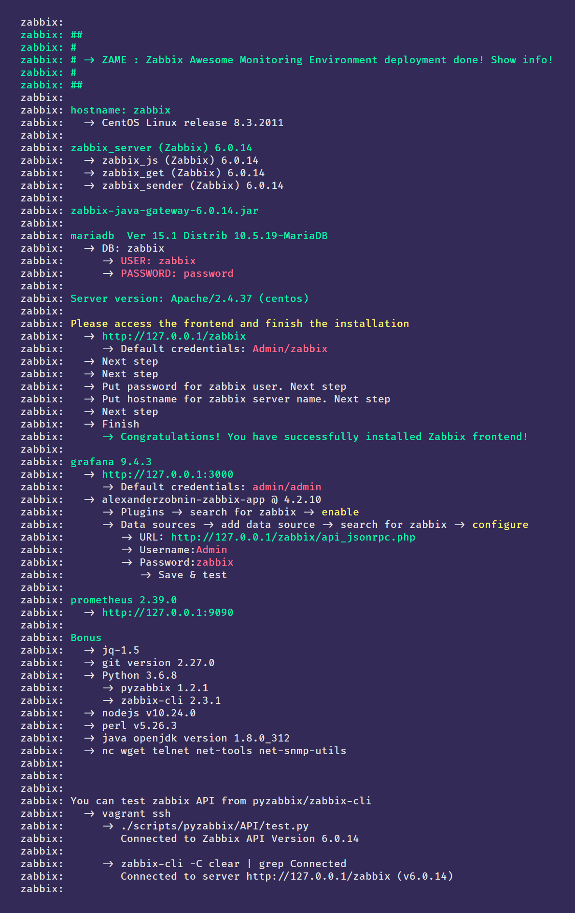

# ZAWE

## _Zabbix Awesome Monitoring Environment_

Vagrantfile/Scripting to deploy a complete ready to use **Zabbix Awesome Monitoring Environment**:

- CentOS Linux release 8.3.2011
- **Zabbix 6 LTS** + ( zabbix-java-gateway zabbix-get zabbix-sender zabbix-js )
- MySQL || PostgreSQL 14 + TimescaleDB2
- Apache || Nginx
- **Grafana** + alexanderzobnin-zabbix-datasource plugin
- **Prometheus**
- jq git python java perl nodejs pyzabbix zabbix-cli
- nc wget telnet net-tools net-snmp-utils

## Start

**>_ vagrant up**

At the end you should see something like the following according webserver and db selected:

## Vagrantfile configuration

In **Vagrantfile** you can set your preferences in this line:

zabbix.vm.provision "shell", path: "bootstrap.sh", args: "**apache mysql**"

> You can choose **apache || nginx** webserver and **mysql || pgsql** db.
> apache && mysql by **default.**

You can choose OS too:

zabbix.vm.box = "**centos/8**"

> Tested with:
- centos/8
- almalinux/8

**Ports**
If needed because of your local configuration just modify the **host port:**

zabbix.vm.network "forwarded_port", **guest: 80 , host: 80**
zabbix.vm.network "forwarded_port", **guest: 8080 , host: 8080**

zabbix.vm.network "forwarded_port", **guest: 3000 , host: 3000**

zabbix.vm.network "forwarded_port", **guest: 9090 , host: 9090**

zabbix.vm.network "forwarded_port", **guest: 3306 , host: 3306**
zabbix.vm.network "forwarded_port", **guest: 5432 , host: 5432**

zabbix.vm.network "forwarded_port", **guest: 10050 , host: 10050**
zabbix.vm.network "forwarded_port", **guest: 10051 , host: 10051**
zabbix.vm.network "forwarded_port", **guest: 10052 , host: 10052**

## bootstrap.sh configuration

You should set timezone properly:

**TIMEZONE**="America/Argentina/Buenos_Aires"
